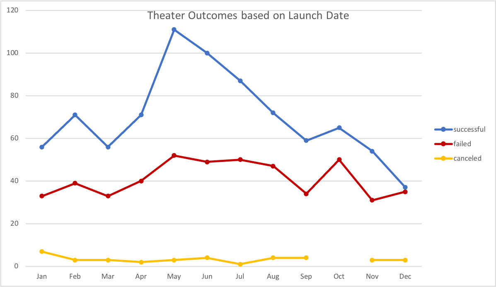
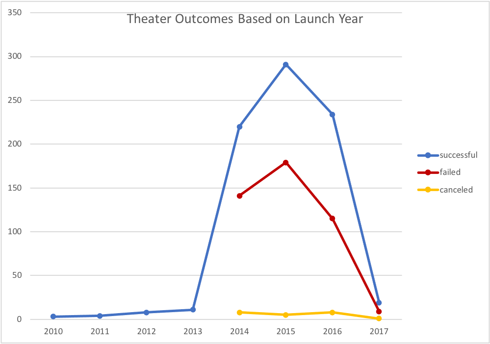
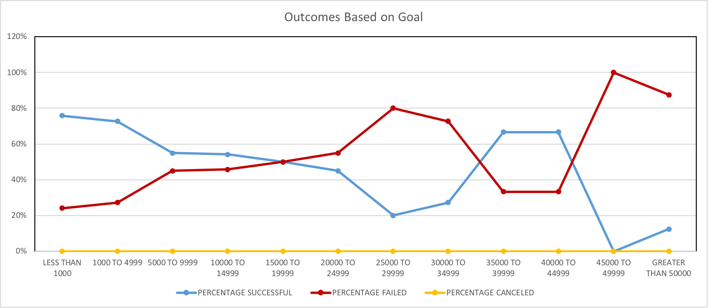

# An Analysis of Kickstarter Campaigns 
Preforming analysis on Kickstarter data to uncover trends

## Overview of Project
 
Our client, Louise, is an up-and-coming playwright and is looking to start a crowdfunding campaign for her play, “Fever”. She is estimating a budget of $10,000 but is hesitant to jump into her first fundraising campaign. Using Excel, I have analyzed and organized current Kickstarter data to determine whether there are specific factors that make a project's campaign successful.  
 
## Analysis and Challenges
 
 ### Analysis of Outcomes Based on Launch Date
 
 
 
The line chart above depicts the total number of successful, failed, and canceled Kickstarter campaigns for each month. The months that launched the most successful theater Kickstarter campaigns were May and June. However, April, July, and October all had the same number of failed campaigns launched. Thus, theater campaigns are more successful launching in the early summer months and taper off by the end of the year. Although if look at total number of theater Kickstarters based per year, you notice that there was a dramatic increase from 2014-2016 and drop off exponentially in 2017. 

 
 ### Analysis of Outcomes Based on Goals
 

 
After analyzing the failed and successful Kickstarter campaigns in the US, I found that failed Kickstarter campaigns had much higher campaign goals than successful Kickstarters. Based on this data, Louise is asking for more than twice her average successful Kickstarter goal. In addition, the mean and median pledged amounts are much lower than the successful pledges which indicates that failed Kickstarter campaigns are unsuccessful for reasons other than asking for too much money. Since the median is much lower, there must be another factor in keeping people from pledging to those unsuccessful projects. 

 ### Challenges and Difficulties Encountered
 
 Some difficulties that I have encountered throughout this project was formatting and executing correct syntax when writing long functions to calculate certain statistics. For example, I used the COUNTIFS function to calculate the total number of successful, failed, and canceled Kickstarters based on each goal amount. At first, I did not set the correct limitations in order to find the total number of goals with a value of $15,000 to $19,999. I mistakenly wrote the function to calculate goals that were less than $19,999 but greater than $15,000 but forgot to include $15,000 and $19,999 as values as well. Another challenge I had overcome was understanding how Pivot tables and Pivot Charts work in order to display information in a concise and helpful way. 
 
 ## Results
 
### What are some limitations of this dataset?

While combing through the data set there were some limitations that I noticed. First, there were no metrics that describe the success of each industry/category during the time. It would be helpful to have data that shows whether or not each industry/ category did well during its time. This could help us account for external factors while analyzing the data. 
 
### What are some other possible tables and/or graphs that we could create?

Some other tables and graphs that we could create are tables showing the most successful categories/subcategories with detailed data into each category/subcategory's level of success. Possible metrics include success rate per category, measures of central tendency for goals, average donation, percent funded, etc. 

Another table/graph we could create is one that displays how much time organizations have to complete the Kickstarter campaigns for the most successful and least successful types of programs. It is possible that having more time to achieve funding targets can lead to greater rates of success.

